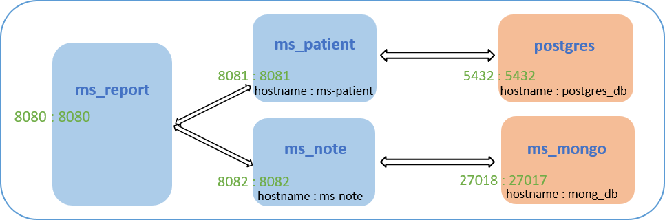

# Mediscreen  
Mediscreen is an application used by doctors to detect patients at risk of developing diabetes.  
From some information (like age, sex...) and the historic (notes) of the patient, this application can generate 
a report. 4 risk levels are used:
* none 
* borderline
* in danger
* early onset

ms_report is the main microservice of Mediscreen application.  

--------------------------------------------------------
### Technologies :
* Java 8
* Maven
* Spring Boot
* Docker
------------------------
### Architecture
Mediscreen uses 4 micro services :
* ms_report (https://github.com/ChocolateSquirrel/ms_report/tree/dev)
* ms_note (https://github.com/ChocolateSquirrel/ms_note/tree/dev)
* ms_demography (https://github.com/ChocolateSquirrel/ms_demography/tree/dev)
* ms_mongo (https://github.com/ChocolateSquirrel/ms_mongo)  


  

--------------------------------
### Deployment with Docker :
* Build the 3 jar (ms_report, ms_note, ms_demography)
* Create image for each micro service : 
  * ```docker build -t ms_patient``` 
  * ```docker build -t ms_mongo```
  * ```docker build -t ms_note```
  *  ```docker build -t ms_report```
* Deploy application : ```docker-compose up -d```  
  To stop the application : ```docker-compose stop```
------------